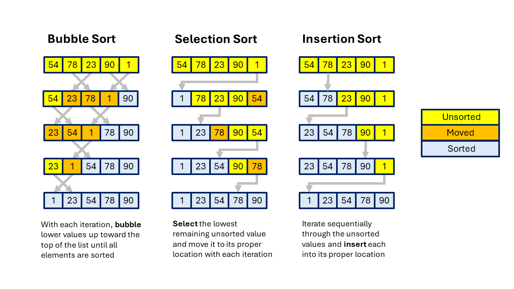

# python-sorts

Collection of sort algorithms implemented with Python

These implementations are NOT meant to be the most efficient, the cleanest, or the best.

They are basic implementations with extra comments to help explain the logic.